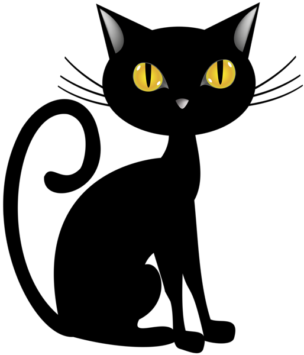
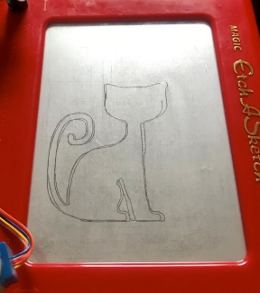

# Code-Etch

Code-Etch is powered by a Raspberry Pi that turns the knobs of the Etch-A-Sketch to convert real life photographs and images to drawings on the Etch-A-Sketch. Drawing with a traditional Etch-A-Sketch can be a frustrating and tedious task for many. In this project we let automation take over and do the creation of art for us. The Raspberry Pi powered Etch-A-Sketch will be capable of drawing images sent to it. We used Canny Edge Detection to identify edges in a picture and reduce noise. The edges are then converted to nodes and the longest path of the node that is connected is identified and sent as instructions to the motors to draw on the Etch-A-Sketch. This project was later expanded to have a web based front-end to allow for images digitally drawn by the user on the screen to be converted into art on the Etch-A-Sketch. This was team effort in which my teammate Dakota Martin and I undertook various roles to produce a working model at the end of a deadline.

